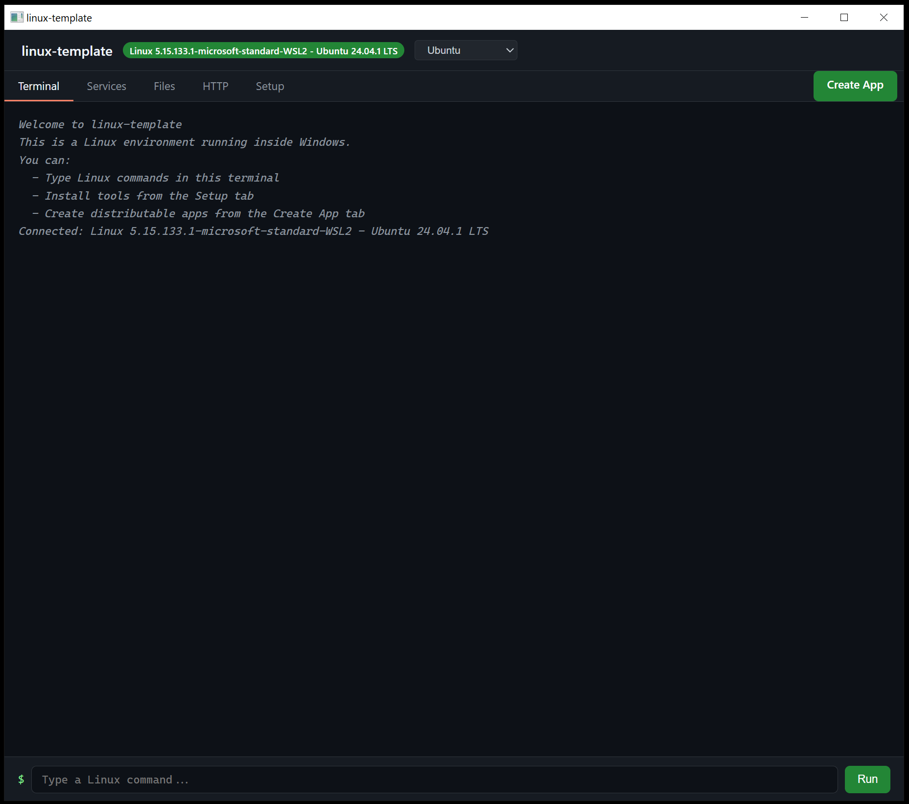
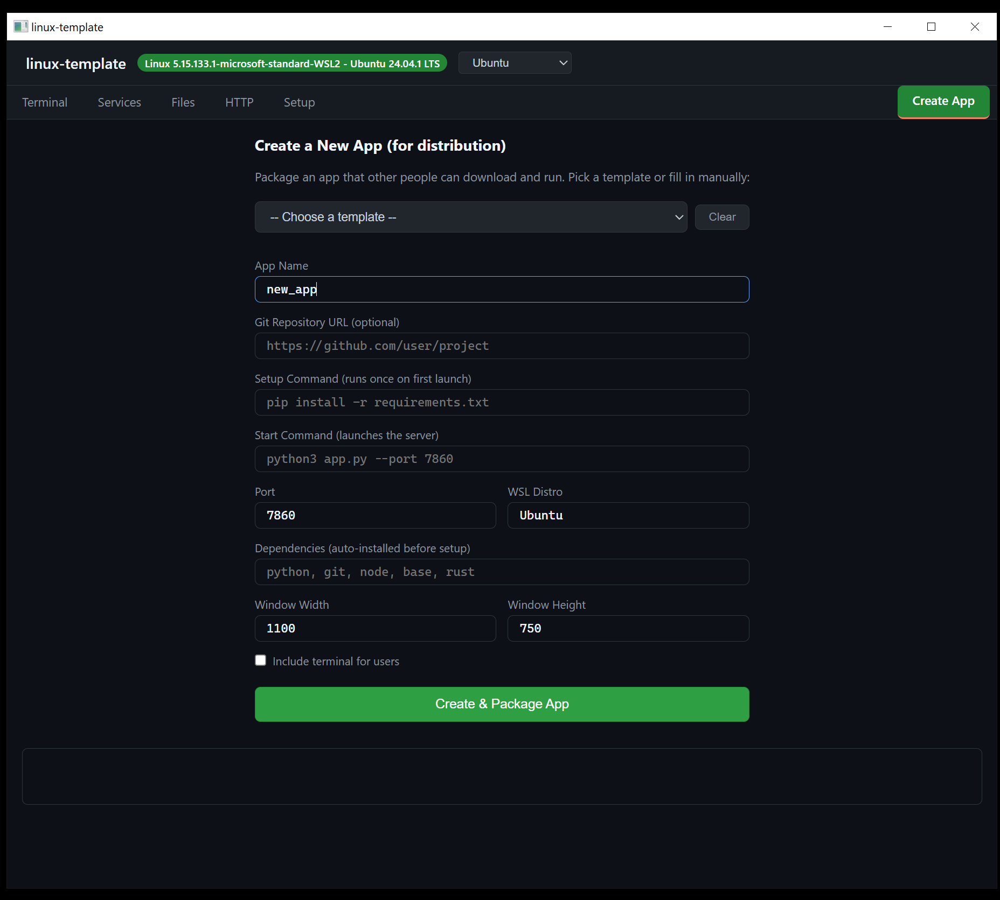
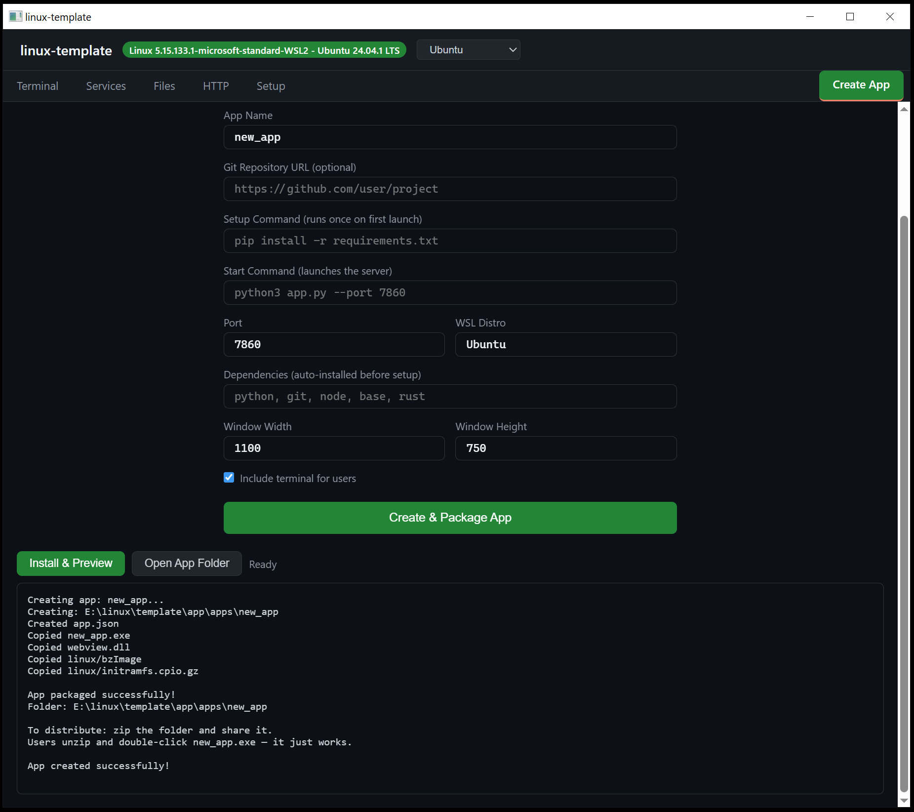
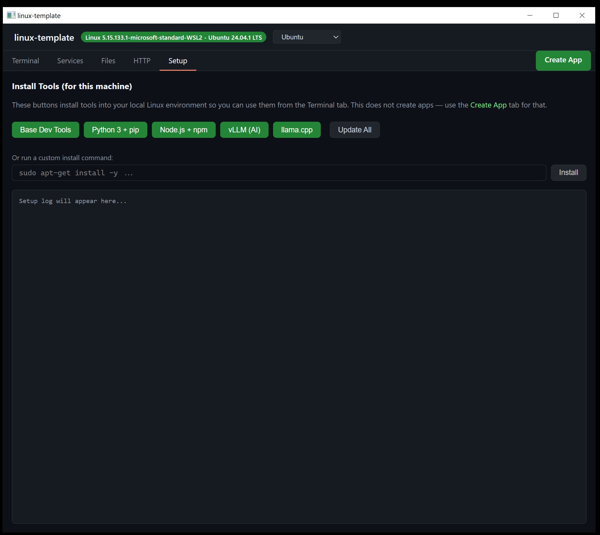
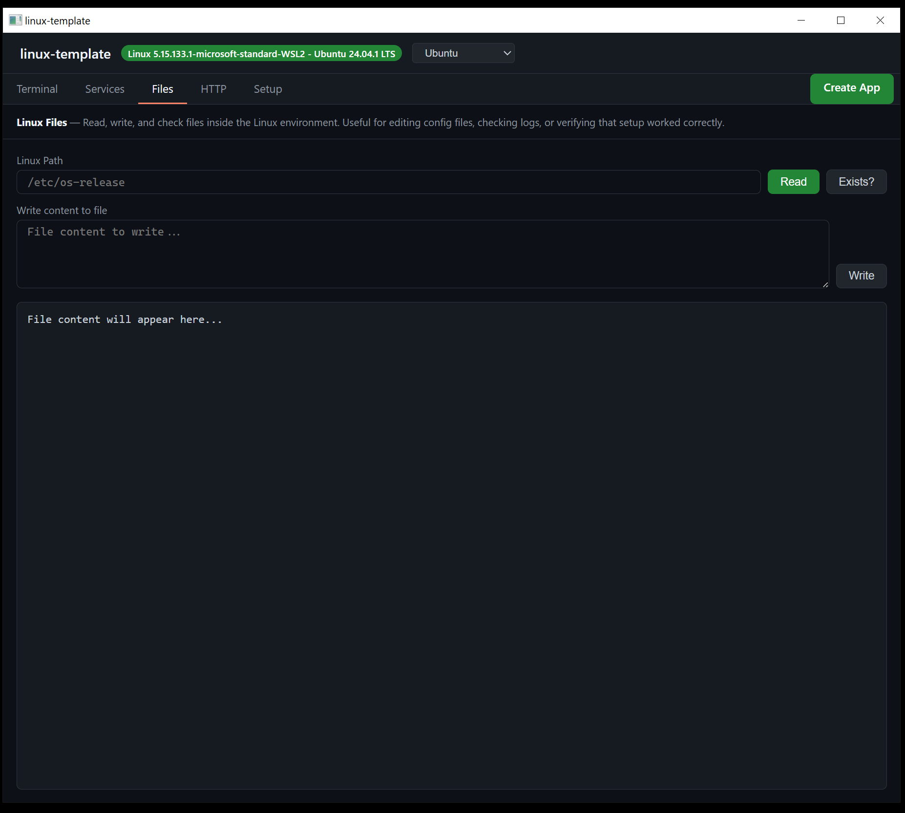
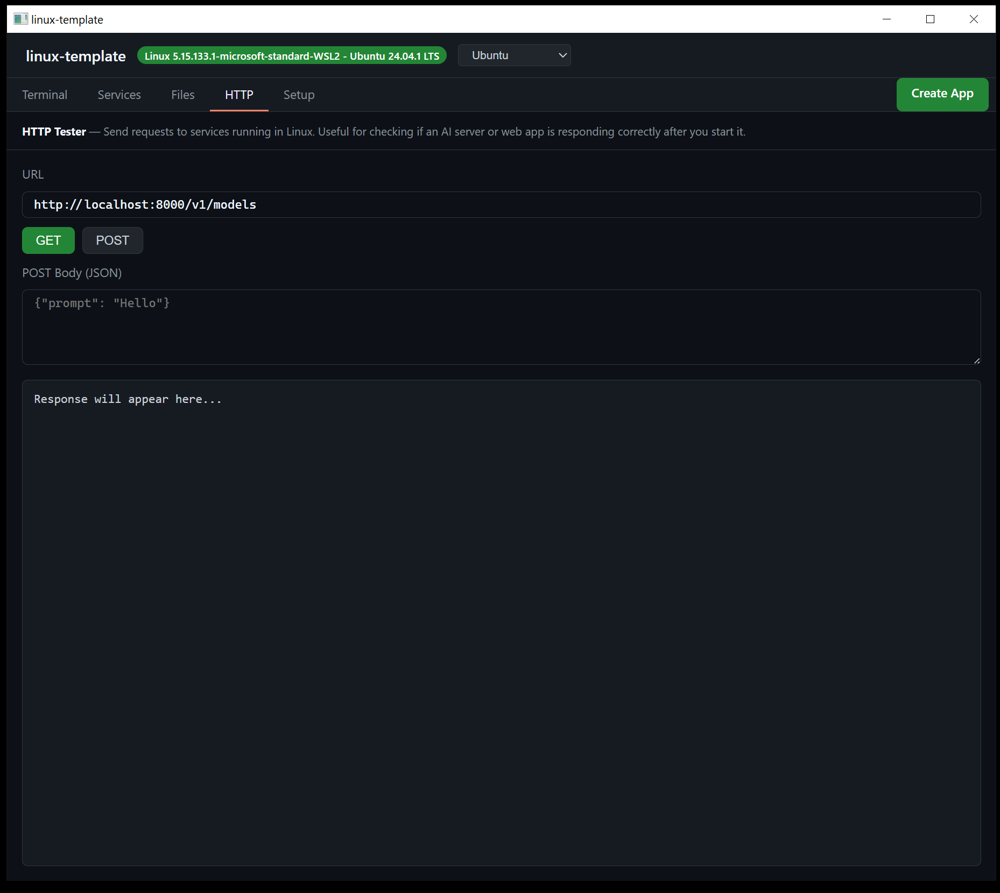
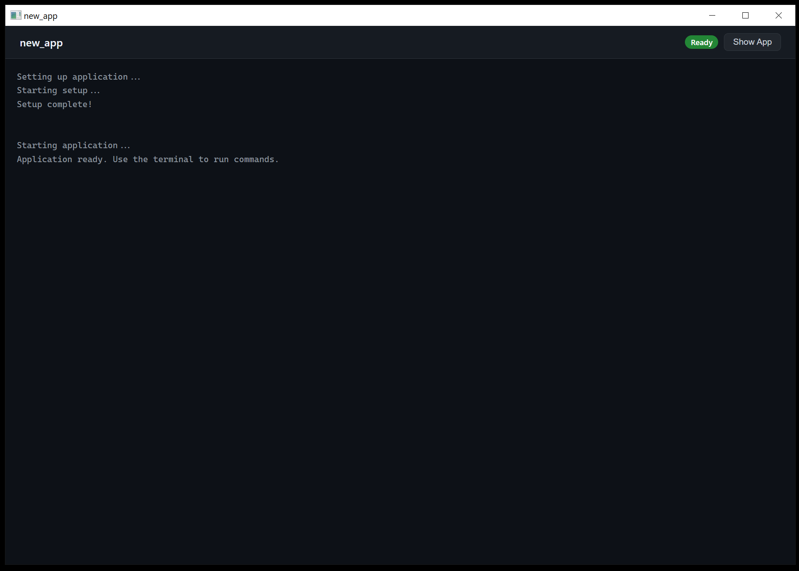

# Portable Linux in a Box

    

**Run Linux apps on Windows with one double-click. Package them for anyone. No Docker, no VMs, no Linux knowledge.**

A single 224 KB executable that auto-detects the best Linux backend (WSL2, QEMU, WHPX, TinyEMU), provides a full development workbench, and lets you create standalone Windows apps that use Linux under the hood — zero configuration, zero coding required. Works on macOS and Linux too.



---

## Why This Exists

Getting a Linux application running on a Windows user's machine typically means:
- Installing WSL and hoping it works
- Fighting with Docker Desktop, GPU passthrough, and YAML configs
- Asking non-technical users to open a terminal and type commands
- Building separate Windows/Linux versions of your software

**This project eliminates all of that.** You fill in a form, click a button, and get a folder with an exe that anyone can double-click. The exe handles WSL detection, Linux environment setup, dependency installation, server startup, and displays the app's web UI in a native window. The user sees a normal Windows app. Linux is invisible.

---

## Highlights

- **One exe, two modes** — Without `app.json`: full developer workbench. With `app.json`: single-purpose app. Same binary.
- **5 Linux backends** — WSL2, WHPX (Hyper-V VM), QEMU (SSH), TinyEMU (RISC-V emulation), Native. Auto-detected. Always works.
- **Zero-code app creation** — Fill in a form, get a distributable folder. 16 pre-configured templates (ComfyUI, vLLM, Ollama, llama.cpp, Flask, Express, PostgreSQL, Jupyter, and more).
- **CLI everywhere** — Every app works with `--cli` or auto-falls back to terminal mode when no GUI is available. Runs on Linux and macOS without WebView2.
- **~224 KB exe** — No runtime, no framework, no garbage. Pure C compiled to a single binary.

---

## Quick Start

### 1. Install WSL (one time)

Open **PowerShell as Admin** and run:
```
wsl --install
```
Restart when prompted. That's the only prerequisite.

### 2. Run the Template

Double-click `linux_template.exe`. You get a 6-tab workbench:

| Tab | What it does |
|-----|-------------|
| **Terminal** | Linux command line in a Windows window |
| **Services** | Start/stop background servers (AI, web, database) |
| **Files** | Read/write/browse the Linux filesystem |
| **HTTP** | Test API endpoints on running services |
| **Setup** | One-click install of Python, Node.js, vLLM, llama.cpp |
| **Create App** | Package a standalone app for distribution |

### 3. Create Your First App

1. Click the green **Create App** tab
2. Pick a template from the dropdown (or type your own settings)
3. Click **Create & Package App**
4. A folder appears with everything needed — exe, config, kernel images
5. Zip it and share it. Users double-click the exe and it just works.





---

## How It Works

### The Template and the Apps Are the Same Binary

```
linux_template.exe              (no app.json)   -->  Developer workbench (6 tabs)
linux_template.exe + app.json                   -->  Runs the configured app
ComfyUI.exe + app.json                          -->  Same binary, renamed, runs ComfyUI
vLLM_Server.exe + app.json                      -->  Same binary, renamed, runs vLLM
my_tool.exe + app.json                          -->  Same binary, renamed, runs your tool
```

The exe checks for `app.json` on launch. If found, it runs that app. If not, it opens the workbench. That's the entire mechanism.

### What the Exe Contains

Every exe — template and apps — ships the same compiled code:

- **5 Linux backends** with automatic detection
- **Bridge layer**: command execution, file transfer (base64), HTTP client, service manager, provisioning engine
- **WebView2 GUI** with full HTML/JS interface
- **CLI mode** with interactive REPL and full app.json support
- **app.json loader** that transforms the generic exe into a specific app

### The Packaging Flow

```
TEMPLATE (what you run)              APP (what you distribute)
+---------------------------+        +---------------------------+
| linux_template.exe        |        | MyApp/                    |
| webview.dll               | -----> |   MyApp.exe   (copy)      |
| linux/bzImage             | Create |   app.json    (generated) |
| linux/initramfs.cpio.gz   |  App   |   webview.dll (copy)      |
| linux/bbl64.bin           |        |   linux/bzImage           |
| linux/rootfs-riscv64.ext2 |        |   linux/initramfs.cpio.gz |
+---------------------------+        |   linux/bbl64.bin         |
                                     |   linux/rootfs-riscv64.ext2|
                                     +---------------------------+
```

The app folder is **completely self-contained**. No references back to the template. Move it anywhere, rename it, put it on a USB stick.

---

## The Template Workbench

### Terminal

A Linux command line inside a native Windows window.


- Type a command, press Enter or click Run
- Color-coded output (commands in blue, output in white, errors in red)
- Up/Down arrows for command history

### Setup

One-click installation of development tools and AI frameworks.



| Button | What it installs |
|--------|-----------------|
| **Base Dev Tools** | gcc, g++, make, curl, wget, git |
| **Python 3 + pip** | Python interpreter + package manager |
| **Node.js + npm** | JavaScript runtime + package manager |
| **vLLM (AI)** | GPU-accelerated LLM inference server |
| **llama.cpp** | CPU/GPU AI model server + TinyLlama test model |
| **Update All** | Updates all installed packages across all languages |

Each button runs a provisioning recipe that checks whether the tool is already installed and skips if so. Custom command input at the bottom for anything else.

### Files

Read, write, and inspect files inside the Linux filesystem.



- **Read**: enter a Linux path (e.g., `/etc/os-release`), see contents
- **Write**: enter a path + content, writes via heredoc
- **Exists?**: check if a path exists

### HTTP

Test HTTP requests against services running in the Linux environment.



- **GET** / **POST** with custom URL and JSON body
- Shows status code and full response

### Services

Manage background Linux processes — servers, databases, AI models.

- Register with name + command + port
- Start/Stop by PID (precise, no accidental kills)
- Health check via HTTP or port probe
- View last 30 lines of service log

### Create App

Package a standalone Windows application. 16 pre-configured templates:

| Category | Templates |
|----------|-----------|
| **AI / ML** | ComfyUI, Llama Chat, vLLM, Ollama, Stable Diffusion WebUI, Text Generation WebUI |
| **Web Dev** | Python Dev Server, Flask, Express.js, Next.js |
| **Databases** | PostgreSQL, Redis |
| **Tools** | Jupyter Notebook, Code Server (VS Code in browser) |

Or fill in your own: app name, git repo, setup command, start command, port, dependencies. Click **Create & Package App** to generate the folder. Click **Install & Preview** to test it live.

---

## What the End User Sees

When someone opens your packaged app:

**First launch** (installs dependencies, clones repo, runs setup):



**After server starts**: the app's web UI fills the window. A "Show Log" button lets them see setup output. If terminal is enabled, a Terminal button opens a command panel.

**Subsequent launches**: setup is skipped, server starts fast.

**Empty apps** (no start command): shows "Ready" immediately with the terminal open — a branded Linux shell.

---

## app.json Reference

The file that transforms the generic exe into a specific app:

```json
{
    "name": "ComfyUI",
    "distro": "Ubuntu",
    "repo": "https://github.com/comfyanonymous/ComfyUI",
    "deps": "python, git",
    "setup": "pip install -r requirements.txt",
    "start": "python3 main.py --port 8188",
    "port": 8188,
    "width": 1200,
    "height": 800,
    "terminal": true
}
```

| Field | Required | Default | Description |
|-------|:--------:|---------|-------------|
| name | No | "Linux App" | Window title |
| distro | No | "Ubuntu" | WSL distribution name |
| repo | No | — | Git repo URL, cloned to `/opt/app` on first run |
| deps | No | — | Comma-separated: `python`, `node`, `git`, `base`, or any apt package |
| setup | No | — | Shell command run after deps and clone |
| start | No | — | Shell command to start the server |
| port | No | 7860 | Port the server listens on |
| width | No | 1100 | Window width in pixels |
| height | No | 750 | Window height in pixels |
| terminal | No | false | Show a terminal button for end users |

You can create or edit `app.json` by hand with any text editor. No need to use the template GUI.

---

## Distributing Your App

After creating an app, you have a self-contained folder:

```
MyApp/
  MyApp.exe              <-- Same binary as the template, renamed
  app.json               <-- Your app's configuration
  webview.dll            <-- WebView2 interop library
  linux/
    bzImage              <-- x86_64 Linux kernel
    initramfs.cpio.gz    <-- Root filesystem
    bbl64.bin            <-- RISC-V kernel (TinyEMU fallback)
    rootfs-riscv64.ext2  <-- RISC-V rootfs (TinyEMU fallback)
```

**To distribute**: zip the folder and share it (email, website, USB). Users unzip and double-click.

**What the user needs**: Windows 10+ with WSL. Nothing else. The app shows setup instructions if WSL is missing.

**What the user does NOT need**: Python, Node.js, Docker, compilers, admin rights (for the app itself), or any Linux knowledge.

---

## CLI Mode

Every app works without a GUI. Use `--cli` or let it auto-detect:

```
linux_template.exe --cli              # Interactive Linux shell
linux_template.exe --cli -v           # Verbose logging
linux_template.exe --distro Debian    # Use specific WSL distro

MyApp.exe --cli                       # Full setup pipeline in terminal
```

| Scenario | What happens |
|----------|-------------|
| Template + GUI | 6-tab workbench |
| Template + `--cli` | Interactive REPL (`$` prompt) |
| Template + no GUI (Linux/macOS) | Auto-falls back to REPL |
| App + GUI | Loading screen, then web UI |
| App + `--cli` | deps > clone > setup > start (all in terminal) |
| App + no start command | "Ready" with terminal panel (GUI) or interactive shell (CLI) |

---

## Platform Support

| Platform | Backend | GUI | CLI |
|----------|---------|-----|-----|
| **Windows 10/11** | WSL2, WHPX, QEMU, TinyEMU | WebView2 | Always works |
| **macOS 11+** | QEMU via Homebrew (HVF accel) | WebKit (Cocoa) | Always works |
| **Linux** | Native (fork/exec) | WebKitGTK | Always works |

**Windows**: WSL2 is the primary path (99% of users). WHPX, QEMU, TinyEMU are automatic fallbacks for machines where WSL can't be installed.

**macOS**: Install QEMU with `brew install qemu`. Uses Apple Hypervisor.framework for hardware acceleration.

**Linux**: Native execution, zero overhead. QEMU available as alternative.

---

## Building from Source

**Windows:**
```
cd template
cmake -B build -G "Visual Studio 17 2022" -A x64
cmake --build build --config Release
```
Requires: Visual Studio 2022, CMake 3.20+, Windows 10 SDK.

**macOS:**
```
cd template
cmake -B build
cmake --build build --config Release
```
Requires: Xcode Command Line Tools, CMake 3.20+. Runtime: `brew install qemu`.

**Linux:**
```
cd template
cmake -B build
cmake --build build --config Release
```
Requires: GCC/Clang, CMake 3.20+, GTK3 + WebKitGTK dev headers (for GUI).

Output:
- `build/Release/linux_template` (or `.exe` on Windows)
- `build/Release/linux_core.lib` (or `.a`) — static library for custom C applications

The only build-time dependency is [webview](https://github.com/webview/webview) v0.12.0, fetched automatically by CMake.

---

## Project Structure

```
template/
  CMakeLists.txt                    Build system (Windows, macOS, Linux)
  src/
    main.c                          Entry point, app.json loader, CLI/GUI dispatch
    compat.h                        Cross-platform threading/timing macros
    linux/
      backend_types.h               Shared types, error codes, growbuf
      backend.h                     Backend vtable interface
      detect.h / detect.c           Auto-detection cascade
      wsl_backend.c                 WSL2 — persistent shell, CRITICAL_SECTION
      qemu_backend.c                QEMU (Windows) — SSH exec, WHPX accel
      qemu_backend_posix.c          QEMU (macOS/Linux) — fork/exec, HVF accel
      tinyemu_backend.c             TinyEMU — RISC-V serial console
      whpx_backend.c                WHPX — WinHvPlatform VM, UART emulation
      native_backend.c              Native Linux — fork/exec
      stub_backend.c                Compile-time placeholder
    bridge/
      bridge.h / pipe_bridge.c      Exec delegation
      fs_bridge.h / fs_bridge.c     File ops (read/write/upload/download/stat)
      http_bridge.h / http_bridge.c HTTP client (WinHTTP + POSIX sockets)
      service.h / service.c         Background service manager
      provision.h / provision.c     Package installation recipes (6 built-in)
      shell_escape.h                POSIX shell argument escaping
      json_escape.h                 JSON string escaping
    gui/
      gui.h                         GUI entry point
      webview_gui.c                 WebView2 GUI — embedded HTML + 11 JS bindings
  linux/
    out/bzImage                     Pre-built x86_64 Linux kernel (10.9 MB)
    out/initramfs.cpio.gz           Pre-built initramfs (3.5 MB)
    out/bbl64.bin                   Pre-built RISC-V kernel for TinyEMU (53 KB)
    out/rootfs-riscv64.ext2         Pre-built RISC-V rootfs for TinyEMU (4 MB)
    Makefile                        Kernel/rootfs build rules
    build_kernel.sh / build_rootfs.sh
    overlay/setup.sh
  samples/
    comfyui.json                    Example app.json
    llama-chat.json                 Example app.json
    dev-server.json                 Example app.json
  app/                              Pre-built ready-to-run template
```

---

## For Developers (C API)

The template is built on `linux_core.lib`, a C static library you can link into your own programs:

```c
#include "linux/detect.h"
#include "bridge/bridge.h"
#include "bridge/fs_bridge.h"
#include "bridge/service.h"

// Auto-detect and start the best backend
linux_config_t config = { .distro_name = "Ubuntu" };
linux_backend_t *b = linux_detect_backend(&config);
b->start(b, &config);

// Run commands
char *out = NULL;
int code;
b->exec(b, "python3 -c 'print(1+1)'", &out, NULL, &code);
printf("%s", out);  // "2\n"
free(out);

// File operations (work with ALL backends via base64)
fs_write_file(b, "/tmp/hello.txt", "Hello from C");
fs_upload(b, "C:\\local\\file.bin", "/tmp/file.bin");
fs_download(b, "/tmp/file.bin", "C:\\local\\copy.bin");

// Service management
service_manager_t mgr;
svc_init(&mgr, b);
int idx = svc_register(&mgr, "web", "python3 -m http.server 8080", NULL, 8080);
svc_start(&mgr, idx);
svc_stop(&mgr, idx);

// HTTP requests to Linux services
http_response_t resp;
http_get("http://localhost:8080/", &resp);
printf("Status: %d\n", resp.status_code);
http_response_free(&resp);

// Provisioning
provision_recipe_t py = provision_recipe_python();
provision_run(b, &py, my_progress_callback, NULL);

// Cleanup
b->stop(b);
b->destroy(b);
```

---

## Troubleshooting

| Problem | Solution |
|---------|----------|
| "Setup Required" screen | WSL not installed. Run `wsl --install` in admin PowerShell, restart. |
| "WebView2 not available" | Missing Edge or WebView2 runtime. App auto-falls back to CLI. |
| "Distribution not registered" | Wrong distro name. Run `wsl --install -d Ubuntu`. |
| "Server did not start in time" | Check the log. Common: wrong port, missing deps, typo in start command. |
| Setup tab install fails | Run `sudo apt-get update` in terminal first. |
| Console window flashes on first launch | Normal — WSL VM is booting. Goes away after first launch per session. |
| App hangs on "Waiting for server..." | The start command is wrong or the port doesn't match. |
| macOS: "QEMU not found" | Install with `brew install qemu`. |

---

## Credits and Acknowledgments

This project builds on the work of:

| Component | Author / Project | License | Used For |
|-----------|-----------------|---------|----------|
| [webview](https://github.com/webview/webview) | Serge Zaitsev, Steffen Andre Langnes | MIT | Cross-platform GUI (WebView2/WebKit) |
| [WebView2](https://developer.microsoft.com/en-us/microsoft-edge/webview2/) | Microsoft | Redistributable | Windows GUI rendering |
| [WSL](https://learn.microsoft.com/en-us/windows/wsl/) | Microsoft | Part of Windows | Primary Linux backend |
| [QEMU](https://www.qemu.org/) | Fabrice Bellard et al. | GPL-2.0 | VM backend (Windows/macOS) |
| [TinyEMU](https://bellard.org/tinyemu/) | Fabrice Bellard | MIT | RISC-V emulation fallback |
| [WinHvPlatform](https://learn.microsoft.com/en-us/virtualization/api/) | Microsoft | Part of Windows | WHPX hypervisor backend |
| [Linux Kernel](https://kernel.org/) | Linus Torvalds et al. | GPL-2.0 | The kernel images in `linux/` |

---

## Quick Reference

| I want to... | Do this |
|--------------|---------|
| Run a Linux command | Terminal tab > type command > Enter |
| Install Python | Setup tab > "Python 3 + pip" |
| Install an AI server | Setup tab > "llama.cpp" or "vLLM" |
| Start a background service | Services tab > register > Start |
| Create an app for distribution | Create App tab > fill form > Create & Package |
| Create an empty shell app | Create App tab > just enter a name > Create & Package |
| Load a template config | Create App tab > dropdown > select template |
| Update all tools | Setup tab > "Update All" |
| Test an API endpoint | HTTP tab > URL > GET or POST |
| Read/write a Linux file | Files tab > path > Read or Write |
| Switch WSL distro | Header dropdown |
| Run without GUI | Add `--cli` flag |
| Edit an app after creation | Open its `app.json` in any text editor |
| Build from source | `cmake -B build && cmake --build build` |

---

*Built with [Claude Code](https://claude.ai/claude-code) as AI pair programmer.*
